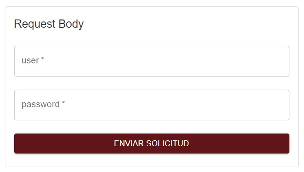

# Proyecto: SUM API

## Integrantes del proyecto.
- Ames Camayo, Daniel Vides.
- Cjumo Chumbes, Jose Carlos
- Ortiz Quispe, Akcel Eduardo.
- Ramirez Alvarado, Piero Jaime.
- Santa Cruz Pachas, Edward Grover.

---

## Descripción

Este proyecto es una aplicación desarrollada con **Java** y el framework **Spring Boot**. Su objetivo principal es facilitar la realización de proyectos académicos que requieren acceso a información gestionada por el SUM. Al consolidar estas herramientas en un solo punto de encuentro, se fomenta la creación de sistemas más eficientes y accesibles para los alumnos.

---

## Tecnologías Utilizadas
- **Java 17**
- **Spring Boot 3.3.6**
- **Maven** (para la gestión de dependencias)
- **Base de Datos**: MySQL (en tiempo de ejecución) y H2 (para pruebas)
- **Lombok 1.18.36** (para simplificar el código repetitivo)
- **Jsoup 1.16.1** (para parseo de HTML)
- **Bucket4j 8.0.1** (para limitación de tasa)
- **Spring Security** (para autenticación y autorización)
- **JUnit** (para pruebas unitarias e integración)
- **Jacoco** (para cobertura de código)
- **SonarQube** (para análisis de calidad del código)

---

## Requisitos Previos
Antes de ejecutar este proyecto, asegúrese de tener instalados los siguientes componentes:

- **Java Development Kit (JDK) 17**
- **Maven**
- **Base de Datos**: MySQL
- **IDE recomendado**: IntelliJ IDEA, Eclipse, etc.

Para verificar que Java esté instalado correctamente, ejecute el siguiente comando:
```bash
java -version
```

Para verificar que Maven esté instalado correctamente, ejecute:
```bash
mvn -version
```

---

## Instalación y Configuración
1. **Clonar el repositorio**:
   ```bash
   git clone https://github.com/klad3/sm-sum-api.git
   ```

2. **Acceder al directorio del proyecto**:
   ```bash
   cd sm-sum-api
   ```

3. **Configurar el archivo `application.properties`**:
   En `src/main/resources/application.properties`, configure los parámetros de la base de datos, como se muestra a continuación:
   ```properties
   spring.datasource.url=jdbc:mysql://localhost:3306/[nombre_de_la_base_de_datos]
   spring.datasource.username=[tu_usuario]
   spring.datasource.password=[tu_contraseña]
   spring.jpa.hibernate.ddl-auto=update
   ````

4. **Compilar y construir el proyecto**:
   ```bash
   mvn clean install
   ```

5. **Ejecutar la aplicación**:
   ```bash
   mvn spring-boot:run
   ```
   La aplicación estará disponible en: `http://localhost:8080`

---

## Estructura del Proyecto
```
├── src
│   ├── main
│   │   ├── java
│   │   │   └── me
│   │   │       └── klad3
│   │   │           └── sumapispring
│   │   │               ├── config
│   │   │               │   └── SecurityConfig
│   │   │               ├── controller
│   │   │               │   ├── AuthController
│   │   │               │   ├── CourseController
│   │   │               │   └── UserController
│   │   │               ├── dto
│   │   │               │   ├── ApiResponse
│   │   │               │   ├── CourseResponse
│   │   │               │   ├── CreateUserRequest
│   │   │               │   ├── CreateUserResponse
│   │   │               │   ├── ErrorResponse
│   │   │               │   ├── LoginRequest
│   │   │               │   ├── LoginResponse
│   │   │               │   └── MatriculaResponse
│   │   │               ├── exception
│   │   │               │   ├── ApiKeyUnauthorizedException
│   │   │               │   ├── AuthenticationException
│   │   │               │   ├── BadRequestException
│   │   │               │   ├── ExternalApiException
│   │   │               │   ├── GlobalExceptionHandler
│   │   │               │   ├── ResourceAlreadyExistsException
│   │   │               │   └── ResourceNotFoundException
│   │   │               ├── model
│   │   │               │   └── User
│   │   │               ├── repository
│   │   │               │   └── UserRepository
│   │   │               ├── security
│   │   │               │   └── ApiKeyAuthFilter
│   │   │               ├── service
│   │   │               │   ├── AuthService
│   │   │               │   ├── CourseService
│   │   │               │   └── UserService
│   │   │               ├── util
│   │   │               │   ├── HtmlParserUtil
│   │   │               │   └── HttpClientUtil
│   │   │               └── LaunchApplication
│   │   └── resources
│   │       ├── application.properties
│   │       └── static (archivos estáticos, como HTML, CSS, JS)
│   └── test
│       └── [pruebas unitarias y de integración]
├── pom.xml (archivo de dependencias de Maven)
└── README.md (este archivo)
```

---

## Endpoints de la API
A continuación, se muestra una lista de los principales endpoints expuestos por la API:

### AuthController
| Método | Endpoint      | Descripción                                   |
|--------|---------------|-----------------------------------------------|
| POST   | /user/login   | Inicia sesión con las credenciales del usuario. |

### CourseController
| Método | Endpoint       | Descripción                            |
|--------|----------------|----------------------------------------|
| GET    | /api/courses   | Obtiene una lista de cursos disponibles. |

### UserController
| Método | Endpoint        | Descripción                        |
|--------|-----------------|------------------------------------|
| POST   | /user/create    | Crea un nuevo usuario en el sistema. |

---

## Pruebas
Para ejecutar las pruebas unitarias y de integración, use el siguiente comando:
```bash
mvn test
```
Los resultados de las pruebas se mostrarán en la consola, con detalles de las pruebas que pasaron o fallaron.

---

## Contribución
Si deseas contribuir a este proyecto, sigue estos pasos:
1. Realiza un **fork** del repositorio.
2. Crea una rama con una nueva función (`git checkout -b nueva-funcion`).
3. Realiza los cambios y confirma los cambios (`git commit -m 'Añadir nueva función'`).
4. Empuja la rama a tu repositorio (`git push origin nueva-funcion`).
5. Crea un **pull request** para que revisemos los cambios.

---

## Instalación y Configuración del Pipeline de CI/CD (Jenkins)
### Prerrequisitos
- Jenkins instalado y funcionando.
- Acceso al repositorio de GitHub del proyecto.
- Servidor de despliegue accesible vía SSH.
- SonarQube configurado para el análisis estático de código.
- Docker y Docker Compose instalados en el servidor de despliegue.
### Configuración del Pipeline
- Crear un nuevo job del tipo "pipeline" en Jenkins
- Configurar el pipeline en el campo Script de Pipeline usando el script indicado.
### Definición de las etapas del Pipeline.
1. Checkout.
- Clonar el repositorio desde GitHub en la rama especificada.
2. Instalación de Dependencias del Backend.
- Navegar al directorio backend y ejecutar la instalación de dependencias usando Maven sin ejecutar pruebas.
3. Análisis de Código Estático
- Realizar un análisis de código estático con SonarQube en el directorio backend.
4. Ejecución de Pruebas Unitarias.
- Ejecutar las pruebas unitarias del backend con Maven.
- Publicar los resultados de las pruebas en Jenkins.
5. Ejecución de Pruebas Funcionales.
- Descargar y preparar el script wait-for-it.sh para esperar a que los servicios estén listos.
- Ejecutar los contenedores de prueba definidos en docker-compose.test.yml.
- Ejecuta las pruebas funcionales utilizando Selenium y publica los resultados en Jenkins.
6. Despliegue en VPS.
- Utilizar SSH para conectarse al servidor de despliegue.
- Navegar al directorio de trabajo, realizar un git pull y desplegar los contenedores definidos en docker-compose.yml.
### Capturas del proceso del pipeline.
### 1. Resultados de SonarQube.

### 2. Stage View.


---

## Funcionalidades
### 1. Ingreso con credenciales
Permite a los usuarios ingresar con sus respectivas credenciales al sistema.

### 2. Visualización de headers 
Permite visualizar los respectivos headers del sistema, en este caso, las variables API_KEY y API_SECRET.

### 3. Envío de solicitud.
Envíos a través de credenciales de un determinado usuario. 


---

**¡Gracias por usar API UNMSM!**

